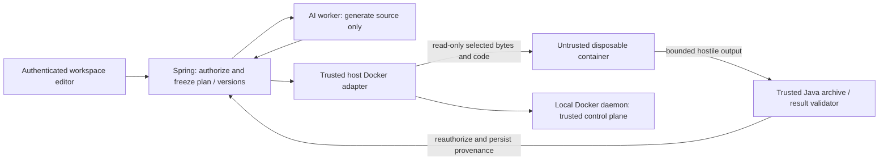

# ADR-008: disposable containers for untrusted analysis code

- Status: Accepted for the local execution contract; cloud execution deferred
- Date: 2026-10-07
- Backlog: RH-142 (14.3); prerequisite: Task 14.2 / RH-141 computation planning
- Review: [threat model](../security/analysis-execution-threat-model.md) and
  [technical review record](../security/analysis-execution-review.json)

## Context and prerequisite

ResearchHub needs real CSV/XLSX computations without granting generated Python application capabilities.
The Spring modular monolith owns authorization, orchestration, persistence and provenance. The existing
AI worker generates a structured plan and source code; neither a valid plan nor model instructions make
that code trusted. Treat prompts, dataset content, code, stdout/stderr and every output byte as hostile.

Task 14.2 is present in `analysis/` in Java and the worker, with versioned
`contracts/analysis/computation-plan/v1` contracts and Flyway V20. It preserves selected immutable source
versions and audited plans. This ADR adds no public endpoint, database schema or new service.

The inherited repository already contains RH-143–145 execution (commits `9d7c70b` and `7ea7cce`),
without a separate execution ADR. RH-142 cannot retroactively satisfy that historical sequencing.
This change records a technical review of the inherited boundary and establishes the prerequisite for
subsequent work: **review and commit this ADR, its threat model and matching review record before
implementing or executing generated analysis code**. Changes to these decisions require another review
and a separate committed policy change before dependent execution changes. CI checks the committed
review before execution tests; that check is not proof of independent human approval or when code was
first authored. Repository maintainers retain normal PR review responsibility.

## Decision and trust boundary

Use the existing `SandboxRunner` port and a trusted, local Docker adapter. Start one fresh Linux
container per attempt. Never evaluate, import or execute generated source inside Spring or the main
AI worker. No warm container pool, application-network connection, persistent analysis volume or
prompt-controlled runtime settings are permitted.

Only the trusted adapter accesses the local Unix Docker socket. Its privileges are part of the trusted
computing base, together with Spring, the host/VM kernel, Docker daemon and reviewed runtime image.
Generated code gets no socket, API token, service URL, storage credential or database access. The
adapter uses argument arrays, an empty Docker config and a cleared CLI environment; never a shell,
implicit remote Docker context or client-supplied command. Docker administrators can still modify
images/containers: Docker isolation does not defend against a compromised host administrator.

Workspace permission is checked on enqueue, dispatch, selected source reads and publication; artifact
and history reads are independently authorized. Owner/editor can run in active workspaces; viewers
can inspect existing authorized results. Foreign resources remain concealed by `404`. Session/CSRF
and existing analysis quotas remain mandatory. A plan names outputs and selects data, not capabilities.

## Local execution policy

| Control | Required policy / inherited default |
| --- | --- |
| Image | `researchhub-sandbox:1.1.1`, resolved to a local SHA-256 image ID; `--pull never`; saved reruns use their exact recorded ID/version without fallback |
| Identity | UID/GID `65532:65532`; all capabilities dropped; `no-new-privileges`; Docker default seccomp enabled; no privileged mode, devices or host namespaces |
| Network | `--network none`, no published ports, no application network or host socket mounts; loopback inside the container conveys no application access |
| Root filesystem | Read-only; fixed `/execution` working directory; IPC disabled |
| Code / manifest | Server-created files under `/execution`, mounted read-only; manifest <=64 KiB, generated code <=32,000 UTF-8 bytes |
| Inputs | Only selected immutable CSV/XLSX bytes under `/inputs/<sourceVersionUUID>.csv\|xlsx`, read-only; verify SHA-256 before launch and in the runtime |
| Input budget | 1–5 versions; application limit 32 MiB each / 64 MiB total; original filename never becomes a host path |
| Outputs | Fresh anonymous local-driver tmpfs volume mounted only at `/outputs`; 16 MiB / 128 inodes; `noexec,nosuid,nodev`; no volume reuse |
| Scratch | Private `/tmp` tmpfs; 16 MiB / 256 inodes; `noexec,nosuid,nodev`; removed per attempt |
| CPU | Default 1 CPU; server range >0 and <=2; scientific BLAS/OpenMP thread defaults 1 |
| Memory | Default 256 MiB; server range 64–512 MiB; memory+swap equals memory, disabling additional swap |
| Processes / files | Default 64 PIDs; server range 8–128, including threads/children; 128 file descriptors; core dumps disabled |
| Time | Startup-inclusive default 45 s, maximum 120 s through collection; cleanup separately bounded to 10 s; remove whole container on timeout |
| Logs | Retain <=64 KiB each stdout/stderr, continue draining; Docker logging disabled; persisted summaries sanitized and <=8,192 characters each |
| Collection | Pause all container processes; read bounded tar in memory; never extract attacker paths on the host |
| Completion | Validate, remove container and anonymous volumes, then publish; cleanup failure publishes no result; stale attempts fail, never silently rerun |

The trusted idle PID1 keeps the tmpfs volume available while a fixed `docker exec` starts the runtime.
Docker archive collection does not reliably include direct tmpfs mounts, so the existing local volume
driver mounts tmpfs with hard byte/inode limits. `docker rm --force --volumes` destroys this one-use volume.
Scratch/output limits are independent of JSON validation and must be effective on the target daemon.

The runtime starts Python with isolated imports (`-I`), a fixed environment and no application secrets.
`-I`, `noexec` and pip removal are defense in depth: Python can interpret arbitrary code, use native
libraries, create children and read all selected inputs. OS/container controls enforce the boundary.
Sheet/column selections are provenance and computation intent; they are **not** a confidentiality
boundary within a mounted file. If finer-grained confidentiality is needed, trusted code must materialize
an authorized projection in a separately reviewed change.

## Dependency allowlist and build ownership

Retain pinned Python **3.13.3**, the digest-pinned `python:3.13.3-slim-bookworm` base and all exact
transitive versions in `sandbox/requirements.lock`. The approved scientific API packages are pandas
**2.2.3**, NumPy **2.2.4**, SciPy **1.15.2**, matplotlib **3.10.1** and openpyxl **3.1.5**. The complete
lockfile is the distribution allowlist, not a prompt-controlled import allowlist. The worker retains its
separate pinned runtime and `uv.lock`; scientific execution stays outside Java domain logic.

Only image build installs packages, using binary wheels; pip is removed afterwards. Generated code has
no package-install API, writable site-packages or network route to registries. A program can write its own
Python modules into bounded scratch; this does not authorize installing new image dependencies or
weaken confinement. Native dependencies are untrusted attack surface too. Image/package changes require
review, pinned versions, vulnerability checks and a new runtime identity. A digest identifies bytes;
it does not certify that an image is benign. Keep the existing repository/container scanner workflow.

Java 25 / Spring Boot 4.1.1 and Maven remain unchanged; use the Boot BOM where supported. Existing
Flyway migrations own durable attempts/artifacts. Hibernate only validates the production schema.

## Output validation and provenance

Use the closed [manifest/result contract](../../contracts/analysis/execution/v1/README.md) and
[chart metadata v2](../../contracts/analysis/execution/v2/README.md). Java independently repeats validation
outside the sandbox; in-container validation can be bypassed by hostile code and is not authoritative.

- Accept only regular, flat, unique allowlisted filenames; reject absolute/traversal/nested paths, links,
  devices, duplicate entries and tar path/size overrides. Timestamp-only bounded PAX metadata is allowed.
- Result JSON <=1 MiB, duplicate-key rejection, finite numbers, exact declared output names/kinds and
  no extra files; tables <=100 columns, 10,000 rows, 100,000 cells total; scalar cells only.
- Charts <=8 MiB each / 16 MiB total; verify PNG signature and passive SVG allowlist with external XML
  resolution disabled. No script, events, external URLs or HTML. A PNG signature is not full decoding
  or a pixel-count bound; browser decoder/decompression risks remain recorded in the threat model.
- Serve artifacts through workspace-authorized endpoints with restrictive headers; SVG stays an image,
  never arbitrary inline DOM. Treat result text and logs as data, including instructions embedded in them.
- Retain the accepted plan/code hashes, immutable source versions/content hashes, selections, actor,
  timestamps, attempt identity, duration, exit/failure, truncation flags, image ID/runtime and result hashes.
  Retries create new attempts; a changed dataset never silently replaces historical evidence.

Validation demonstrates contract compliance, not scientific correctness. Neither a plausible chart nor
repeatable code proves a claim. Document insertion/refresh remains an explicit authorized user action.

## Cloud mapping: conditional Container Apps Jobs

Prefer a finite, manually dispatched Azure Container Apps Job behind the same `SandboxRunner` port,
**only after an independent parity review and adversarial tests of a deployed configuration**. This ADR
authorizes no Azure deployment or IaC. The cloud adapter remains absent/disabled. Azure Jobs expose
timeouts/retries/parallelism, but those properties alone do not supply this complete execution boundary.
See [Microsoft Jobs documentation](https://learn.microsoft.com/en-us/azure/container-apps/jobs).

| Local invariant | Required cloud equivalent before approval |
| --- | --- |
| Single fresh attempt | One replica, completion count 1, parallelism 1, platform retry limit 0; Spring owns explicit new attempts and idempotent publication |
| Immutable reviewed image | ACR digest, pinned dependencies and recorded image/runtime identity; image-pull identity unavailable to executing Python |
| No application capabilities | No product DB/storage/model secrets, public ingress or application service connectivity; no job-start/control-plane capability inside the execution container |
| No network exfiltration | Deny egress to Internet, DNS exfiltration, application subnets and metadata/identity endpoints; prove platform traffic allowances cannot be used by Python |
| Read-only inputs / bounded ephemeral writes | Trusted staging and collection outside the hostile job; read-only selected bytes, hard byte/inode caps, no shared writable storage or persistent credentials |
| CPU/memory/PID/deadline | Demonstrate effective CPU/memory/child-process limits and forced whole-job termination with no surviving child; use a stronger isolated job runtime if Jobs cannot enforce them |
| Bounded logs/output | Collection and platform logging must not create an unbounded bill/storage channel; validate outside the job and retain the same public contracts |
| Cleanup and authorization | Destruction/reconciliation on success, failure, timeout and controller crash; reauthorize before dispatch/publication; no output exposed on cleanup failure |

Network controls need an explicit isolated environment and validated egress policy, not simply a private
ingress setting. [Azure network controls](https://learn.microsoft.com/en-us/azure/container-apps/firewall-integration)
describe environment-specific restrictions. [Managed identity configuration](https://learn.microsoft.com/en-us/azure/container-apps/managed-identity)
must keep identities away from the hostile execution phase. Same-container download/upload helpers with
tokens or signed URLs are not an acceptable shortcut: Python could inspect their files, memory or environment.
If Jobs cannot meet an invariant, select an equivalent dedicated VM/microVM job boundary in a follow-up
ADR; never silently relax the local contract or add general-purpose cluster infrastructure here.

## Alternatives and consequences

| Option | Decision |
| --- | --- |
| In-process Java/worker evaluation, AST/import denylist | Rejected: arbitrary Python/native code would inherit service secrets and privileges; textual checks do not establish isolation |
| Long-lived shared notebook/service or reused writable container | Rejected: cross-run persistence and cross-workspace leakage |
| Local disposable Docker | Accepted for explicit local use with the effective controls above; fits the existing port and scientific image |
| VM/microVM or cloud job | Stronger potential host boundary, deferred until cloud parity is demonstrated; adds operational cost |

Container isolation shares a kernel. This is an accepted local-development risk, not a guarantee against
kernel/runtime exploits or an approval for hostile multi-tenant production. Require a maintained daemon
with effective seccomp/cgroup controls; unsupported controls mean execution must remain disabled.
Docker documents [resource constraints](https://docs.docker.com/engine/containers/resource_constraints/),
[daemon security](https://docs.docker.com/engine/security/) and
[seccomp](https://docs.docker.com/engine/security/seccomp/); network namespaces alone do not block
all host communication mechanisms, such as virtual sockets on susceptible configurations.

No unrelated UI, notifications, orchestration service, runtime package API or database migration is added.
The product implications from `design-reference/Analysis_studio.pdf` pp.2–4,
`Results,provenance&insert.pdf` pp.1–3, `Key_user_flows.pdf` p.2 and `DESIGN_SPEC.md` screens 33–37
are preserved: immutable original data, safe failures without raw stack traces, exact code/run provenance,
explicit reruns and explicit report insertion. Design sample filenames/code never define filesystem paths.

## Verification and change gate

The [threat model](../security/analysis-execution-threat-model.md) maps every required threat to concrete
controls and tests. The review record binds this ADR/model by SHA-256 and identifies the audited baseline.
Run `python3 scripts/security/check_analysis_boundary.py` before execution development/testing. It must
fail on missing, rejected, changed, untracked or uncommitted policy/review files. Hashes bind reviewed
bytes; they do not authenticate a reviewer. CI and ordinary maintainer review must protect this record.

After that prerequisite is committed, run the pinned worker and sandbox suites, the real Docker
acceptance suite and `ANALYSIS_SANDBOX_TESTS=true ./mvnw verify`. Keep independent >=80% module
coverage gates. A skipped/unavailable container check provides no evidence of runtime isolation.
Current verification evidence and limitations live in
[analysis security validation](../development/analysis-security-validation.md).
