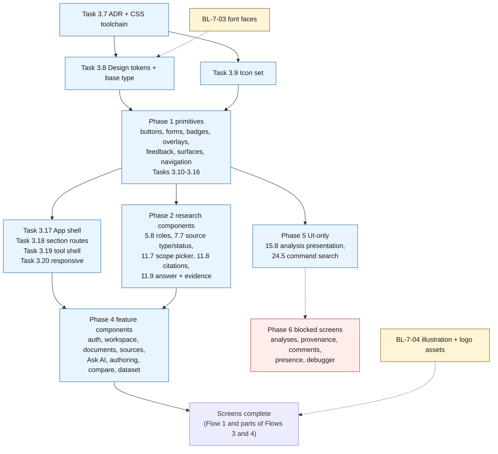
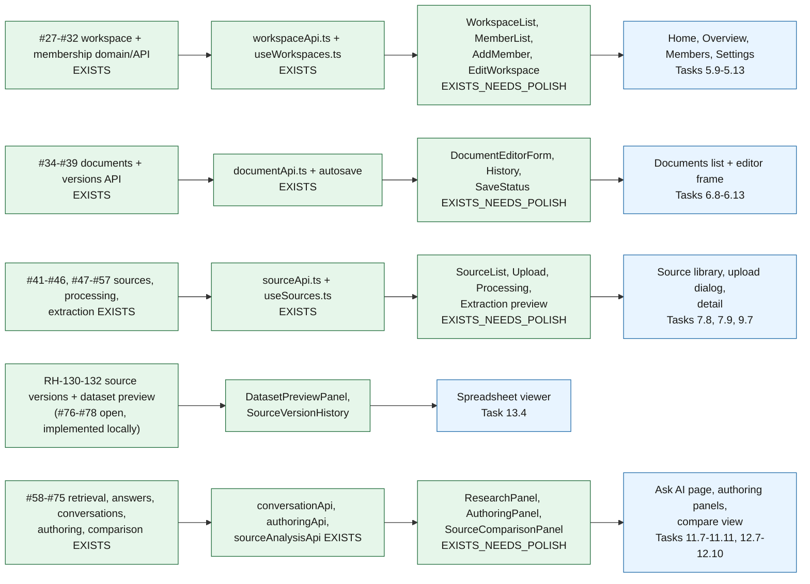
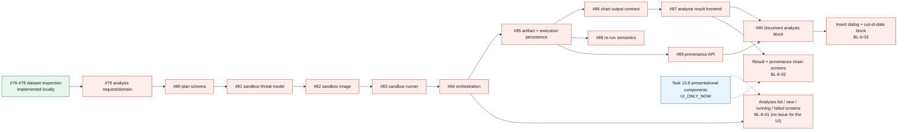
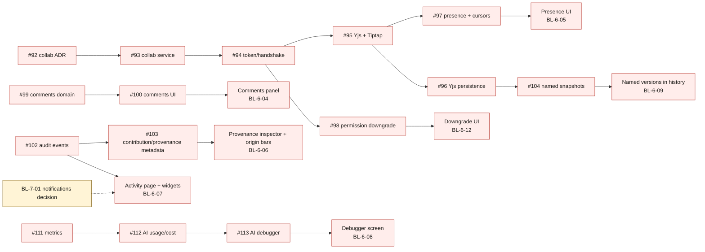
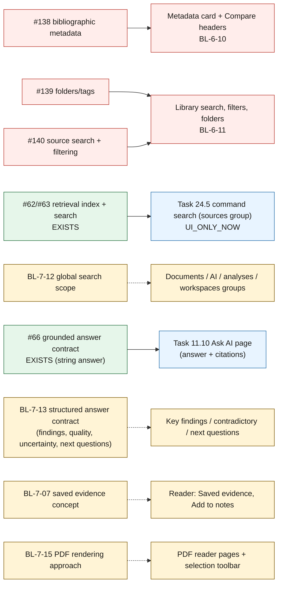

# UI dependencies

Dependency diagrams for the UI work. Existing GitHub issues are referenced by number. Colors: green = exists, blue = proposed new task, red = blocked, amber = needs decision.

## 1. Design dependencies

Order in which the design system can be built. Each arrow means *must exist before*.

### Task-level graph (generated from `issues.json`)

Edges point from a prerequisite task to the task that needs it. Existing tasks appear as green nodes with their issue number.

```mermaid
flowchart LR
  subgraph P0["Phase 0 foundations"]
    NBL_0_01["3.7 Define frontend styling approach and add CSS…"]
    NBL_0_02["3.8 Add design tokens and base typography styles"]
    NBL_0_03["3.9 Add the ResearchHub icon set"]
  end
  subgraph P1["Phase 1 primitives"]
    NBL_1_01["3.10 Build button primitives"]
    NBL_1_02["3.11 Build form field and selection control primi…"]
    NBL_1_03["3.12 Build badge, chip, avatar and sticker primit…"]
    NBL_1_04["3.13 Build overlay primitives: dialog, popover me…"]
    NBL_1_05["3.14 Build feedback primitives: banner, toast, pr…"]
    NBL_1_06["3.15 Build surface primitives: card, list row, da…"]
    NBL_1_07["3.16 Build navigation primitives: tabs, filter ch…"]
  end
  subgraph P3["Phase 3 shell"]
    NBL_3_01["3.17 Build the authenticated app shell with sideb…"]
    NBL_3_02["3.18 Add workspace section routes and navigation…"]
    NBL_3_03["3.19 Build the workspace tool shell with rail, se…"]
    NBL_3_04["3.20 Add responsive shell behavior for narrower d…"]
  end
  subgraph P2["Phase 2 shared components"]
    NBL_2_01["5.8 Add workspace capability helper and role badge"]
    NBL_2_02["7.7 Add source type and processing status compon…"]
    NBL_2_03["11.7 Build AI scope selector and source picker"]
    NBL_2_04["11.8 Build citation chip and citation popover"]
    NBL_2_05["11.9 Build grounded answer block and evidence lis…"]
  end
  subgraph P4["Phase 4 features"]
    NBL_4_01["4.8 Restyle login and register screens with the…"]
    NBL_4_02["5.9 Build workspace home with workspace cards an…"]
    NBL_4_03["5.10 Build the create workspace dialog"]
    NBL_4_04["5.11 Build workspace overview page from existing…"]
    NBL_4_05["5.12 Build members page and role management UI"]
    NBL_4_06["5.13 Build workspace settings page and archive co…"]
    NBL_4_07["6.8 Build documents list page"]
    NBL_4_08["6.9 Build document editor frame with documents c…"]
    NBL_4_09["6.10 Style document paper, formatting toolbar and…"]
    NBL_4_10["6.11 Build save status, conflict and read-only do…"]
    NBL_4_11["6.12 Build document version history panel"]
    NBL_4_22["6.13 Build version diff preview for document hist…"]
    NBL_4_12["7.8 Build source library page"]
    NBL_4_13["7.9 Build upload sources dialog"]
    NBL_4_14["9.7 Build source detail page layout"]
    NBL_4_15["11.10 Build Ask AI page"]
    NBL_4_16["11.11 Build scoped Ask this source view"]
    NBL_4_17["12.7 Build document selection toolbar for AI rewr…"]
    NBL_4_18["12.8 Build generate section panel"]
    NBL_4_19["12.9 Build AI suggestion card and find evidence p…"]
    NBL_4_20["12.10 Build compare sources view"]
    NBL_4_21["13.4 Build spreadsheet viewer from the dataset pr…"]
  end
  subgraph P5["Phase 5 UI-only"]
    NBL_5_01["15.8 Build analysis status, pipeline and result p…"]
    NBL_5_02["24.5 Build command search dialog for workspace so…"]
  end
  E14["#14 Task 3.1"]
  E15["#15 Task 3.2"]
  E16["#16 Task 3.3"]
  E33["#33 Task 5.7"]
  E40["#40 Task 6.7"]
  E46["#46 Task 7.6"]
  E28["#28 Task 5.2"]
  E68["#68 Task 11.5"]
  E73["#73 Task 12.4"]
  E65["#65 Task 11.2"]
  E66["#66 Task 11.3"]
  E69["#69 Task 11.6"]
  E22["#22 Task 4.3"]
  E23["#23 Task 4.4"]
  E29["#29 Task 5.3"]
  E31["#31 Task 5.5"]
  E32["#32 Task 5.6"]
  E30["#30 Task 5.4"]
  E37["#37 Task 6.4"]
  E38["#38 Task 6.5"]
  E36["#36 Task 6.3"]
  E39["#39 Task 6.6"]
  E44["#44 Task 7.4"]
  E57["#57 Task 9.6"]
  E67["#67 Task 11.4"]
  E71["#71 Task 12.2"]
  E70["#70 Task 12.1"]
  E72["#72 Task 12.3"]
  E74["#74 Task 12.5"]
  E75["#75 Task 12.6"]
  E78["#78 Task 13.3"]
  E62["#62 Task 10.5"]
  E14 --> NBL_0_01
  E15 --> NBL_0_01
  NBL_0_01 --> NBL_0_02
  NBL_0_01 --> NBL_0_03
  NBL_0_02 --> NBL_1_01
  NBL_0_03 --> NBL_1_01
  NBL_0_02 --> NBL_1_02
  NBL_1_01 --> NBL_1_02
  NBL_0_02 --> NBL_1_03
  NBL_0_03 --> NBL_1_03
  NBL_0_02 --> NBL_1_04
  NBL_1_01 --> NBL_1_04
  NBL_0_02 --> NBL_1_05
  NBL_0_03 --> NBL_1_05
  NBL_1_01 --> NBL_1_05
  NBL_0_02 --> NBL_1_06
  NBL_1_03 --> NBL_1_06
  NBL_0_02 --> NBL_1_07
  NBL_0_03 --> NBL_1_07
  E16 --> NBL_3_01
  E33 --> NBL_3_01
  NBL_1_01 --> NBL_3_01
  NBL_1_03 --> NBL_3_01
  NBL_1_04 --> NBL_3_01
  NBL_1_07 --> NBL_3_01
  E33 --> NBL_3_02
  E40 --> NBL_3_02
  E46 --> NBL_3_02
  NBL_3_01 --> NBL_3_02
  NBL_1_04 --> NBL_3_03
  NBL_3_01 --> NBL_3_03
  NBL_1_04 --> NBL_3_04
  NBL_3_01 --> NBL_3_04
  NBL_3_03 --> NBL_3_04
  E28 --> NBL_2_01
  NBL_1_03 --> NBL_2_01
  E46 --> NBL_2_02
  NBL_0_03 --> NBL_2_02
  NBL_1_03 --> NBL_2_02
  E68 --> NBL_2_03
  NBL_1_02 --> NBL_2_03
  NBL_1_03 --> NBL_2_03
  E73 --> NBL_2_04
  E65 --> NBL_2_04
  NBL_1_04 --> NBL_2_04
  NBL_1_03 --> NBL_2_04
  E66 --> NBL_2_05
  E69 --> NBL_2_05
  NBL_1_05 --> NBL_2_05
  NBL_2_03 --> NBL_2_05
  NBL_2_04 --> NBL_2_05
  E22 --> NBL_4_01
  E23 --> NBL_4_01
  NBL_0_02 --> NBL_4_01
  NBL_1_02 --> NBL_4_01
  NBL_1_05 --> NBL_4_01
  E33 --> NBL_4_02
  NBL_1_06 --> NBL_4_02
  NBL_1_03 --> NBL_4_02
  NBL_3_01 --> NBL_4_02
  E29 --> NBL_4_03
  NBL_1_02 --> NBL_4_03
  NBL_1_04 --> NBL_4_03
  NBL_4_02 --> NBL_4_03
  NBL_1_06 --> NBL_4_04
  NBL_2_01 --> NBL_4_04
  NBL_2_02 --> NBL_4_04
  NBL_3_02 --> NBL_4_04
  E31 --> NBL_4_05
  E32 --> NBL_4_05
  NBL_1_02 --> NBL_4_05
  NBL_1_04 --> NBL_4_05
  NBL_2_01 --> NBL_4_05
  E30 --> NBL_4_06
  NBL_1_02 --> NBL_4_06
  NBL_1_04 --> NBL_4_06
  NBL_2_01 --> NBL_4_06
  E40 --> NBL_4_07
  NBL_1_06 --> NBL_4_07
  NBL_1_07 --> NBL_4_07
  NBL_3_02 --> NBL_4_07
  E40 --> NBL_4_08
  NBL_3_03 --> NBL_4_08
  E37 --> NBL_4_09
  NBL_0_02 --> NBL_4_09
  NBL_0_03 --> NBL_4_09
  NBL_1_01 --> NBL_4_09
  NBL_4_08 --> NBL_4_09
  E38 --> NBL_4_10
  E36 --> NBL_4_10
  NBL_1_05 --> NBL_4_10
  NBL_4_08 --> NBL_4_10
  E39 --> NBL_4_11
  NBL_1_04 --> NBL_4_11
  NBL_4_08 --> NBL_4_11
  NBL_4_10 --> NBL_4_22
  NBL_4_11 --> NBL_4_22
  E46 --> NBL_4_12
  NBL_1_06 --> NBL_4_12
  NBL_1_07 --> NBL_4_12
  NBL_2_02 --> NBL_4_12
  NBL_3_02 --> NBL_4_12
  E44 --> NBL_4_13
  NBL_1_02 --> NBL_4_13
  NBL_1_04 --> NBL_4_13
  NBL_2_02 --> NBL_4_13
  E57 --> NBL_4_14
  NBL_2_02 --> NBL_4_14
  NBL_3_03 --> NBL_4_14
  NBL_1_06 --> NBL_4_14
  E67 --> NBL_4_15
  E69 --> NBL_4_15
  NBL_2_03 --> NBL_4_15
  NBL_2_04 --> NBL_4_15
  NBL_2_05 --> NBL_4_15
  NBL_3_03 --> NBL_4_15
  E66 --> NBL_4_16
  NBL_4_15 --> NBL_4_16
  NBL_4_14 --> NBL_4_16
  E71 --> NBL_4_17
  NBL_1_04 --> NBL_4_17
  NBL_4_09 --> NBL_4_17
  E70 --> NBL_4_18
  NBL_2_03 --> NBL_4_18
  NBL_3_03 --> NBL_4_18
  NBL_4_09 --> NBL_4_18
  E72 --> NBL_4_19
  NBL_4_17 --> NBL_4_19
  NBL_2_04 --> NBL_4_19
  NBL_2_05 --> NBL_4_19
  E74 --> NBL_4_20
  E75 --> NBL_4_20
  NBL_1_06 --> NBL_4_20
  NBL_2_03 --> NBL_4_20
  NBL_2_04 --> NBL_4_20
  E78 --> NBL_4_21
  NBL_1_06 --> NBL_4_21
  NBL_1_07 --> NBL_4_21
  NBL_2_02 --> NBL_4_21
  NBL_1_03 --> NBL_5_01
  NBL_1_05 --> NBL_5_01
  NBL_1_06 --> NBL_5_01
  E62 --> NBL_5_02
  NBL_1_04 --> NBL_5_02
  NBL_1_02 --> NBL_5_02
  NBL_1_06 --> NBL_5_02
  classDef new fill:#E8F4FF,stroke:#1F6AA8,color:#1B1A17;
  classDef exists fill:#E6F6EA,stroke:#1F6B3A,color:#1B1A17;
  class NBL_0_01,NBL_0_02,NBL_0_03,NBL_1_01,NBL_1_02,NBL_1_03,NBL_1_04,NBL_1_05,NBL_1_06,NBL_1_07,NBL_3_01,NBL_3_02,NBL_3_03,NBL_3_04,NBL_2_01,NBL_2_02,NBL_2_03,NBL_2_04,NBL_2_05,NBL_4_01,NBL_4_02,NBL_4_03,NBL_4_04,NBL_4_05,NBL_4_06,NBL_4_07,NBL_4_08,NBL_4_09,NBL_4_10,NBL_4_11,NBL_4_22,NBL_4_12,NBL_4_13,NBL_4_14,NBL_4_15,NBL_4_16,NBL_4_17,NBL_4_18,NBL_4_19,NBL_4_20,NBL_4_21,NBL_5_01,NBL_5_02 new;
  class E14,E15,E16,E33,E40,E46,E28,E68,E73,E65,E66,E69,E22,E23,E29,E31,E32,E30,E37,E38,E36,E39,E44,E57,E67,E71,E70,E72,E74,E75,E78,E62 exists;
```

## 2. Product dependencies

Contract chain from domain model to screen. A red node is **missing or unstable**; the screen at the end is blocked until the chain is complete.

### 2.1 Workspaces, members, documents, sources, AI (exists)

### 2.2 Analysis studio (blocked end to end)

### 2.3 Collaboration, comments, provenance and history (blocked)

### 2.4 Source workflows, search and the Ask answer contract

## 3. Blocker summary

| Blocked UI | Blocked by | Issue exists? | Backlog |
| --- | --- | --- | --- |
| Analyses list / new / running / failed | #79, #80, #84, #85 | backend yes; **UI issue no** | BL-6-01 |
| Analysis result + provenance chain | #85, #86, #88, #89 → #87 | yes (#87) | BL-6-02 |
| Insert result dialog + analysis block | #87, #88, #89 → #90 | yes (#90) | BL-6-03 |
| Comments | #99 → #100 | yes | BL-6-04 |
| Presence | #92–#95 → #97 | yes | BL-6-05 |
| Provenance inspector + origin bars | #102, #103 | yes | BL-6-06 |
| Activity, Home digest, notifications | #102 + decision | audit yes; notifications no | BL-6-07 / BL-7-01 |
| AI debugger | #111, #112 → #113 | yes | BL-6-08 |
| Named versions | #104 | yes | BL-6-09 |
| Library search/filters/folders | #139, #140 | yes | BL-6-11 |
| Structured Ask answer, claim check, saved evidence, PDF reader pages, profile, invitations, global search | no contract and no issue | **no** | Phase 7 |

